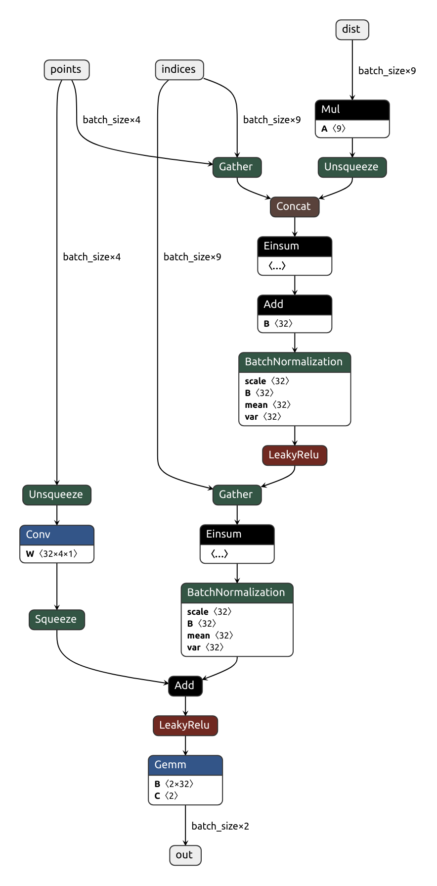

# Todo
* Convert 3D-OutDet PyTorch model to C++ (done)
* Data processing in CPP (on hold: using brute force solution)
* Eval in CPP (done)
* ONNX model (done)
* Weight Conversion in CPP (done)
* TensorRT + CPP (in 2 days)
* ROS Integration (in 2 days)
* Docker Integration (in 1 days)

## Onnx Model from OutDet (image from Netron app)



## How to Build 
``` 
mkdir build 
cd build 
cmake -DCMAKE_PREFIX_PATH=/var/local/home/aburai/outdet_cpp/libtorch -D CMAKE_CUDA_COMPILER=$(which nvcc) ..
make

```